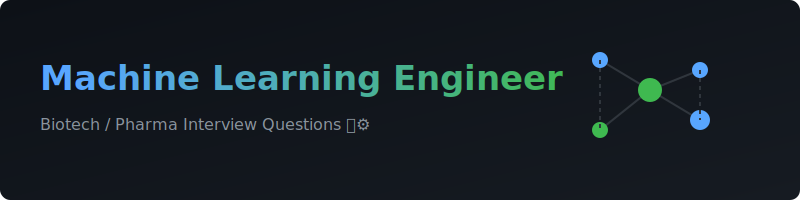

<div align="center">
  
</div>

# 🧬 Machine Learning Engineer (Biotech) Interview Questions ⚙️

<div align="center">
<a href="https://github.com/ishandutta2007/Awesome-Awesome-Awesome"></a><a href="https://discord.gg/jc4xtF58Ve"></a>
</div>

🚀 A curated, community-driven collection of **machine learning engineer biotech interview questions and answers**. This comprehensive **prep guide** (with model answers, frameworks, and explanations) is tailored for **Machine Learning Engineer roles at biotech/pharma companies** — the engineering-focused counterpart to research-facing computational biology roles, covering ML systems, data infrastructure, and production deployment in a biological data context. Perfect for your **machine learning interview preparation**.

💡 This is not a list of trivia. Every question includes:
- 🎯 **Why interviewers ask it**
- 🛠️ **A model answer or framework**
- 🔍 **Follow-up questions** interviewers commonly use to probe deeper

> 🌱 **This is v1.** Contributions, corrections, and new questions are very welcome — see [CONTRIBUTING.md](CONTRIBUTING.md).

> ⚠️ **Note on scope:** This role sits at the intersection of general ML/software engineering and biotech domain context. This repo assumes solid general ML engineering fundamentals already exist (or are covered by general ML engineer interview prep elsewhere) and focuses specifically on **what's different when the data, infrastructure, and stakeholders are biological/pharma**. For deeper domain science content (biology, chemistry, genomics methods), see the companion repos on **Computational Biologist**, **Genomics Data Scientist**, and **AI Drug Discovery Scientist** roles.

---

## 📚 Table of Contents

| # | 🏷️ Category | 📖 What it covers |
|---|----------|-----------------|
| 1 | [🏗️ ML System Design for Biotech](questions/01-ml-system-design-for-biotech.md) | Designing end-to-end ML systems around biological data and workflows |
| 2 | [💾 Data Engineering for Biological Data](questions/02-data-engineering-for-biological-data.md) | Pipelines for omics/imaging/assay data, heterogeneous formats, data lakes |
| 3 | [🧠 Model Development at Scale](questions/03-model-development-at-scale.md) | Distributed training, foundation models, handling biology-specific data challenges |
| 4 | [🚀 MLOps & Production Deployment](questions/04-mlops-and-production-deployment.md) | Model serving, versioning, monitoring, CI/CD for ML in a scientific setting |
| 5 | [☁️ Infrastructure, Compute & Cost](questions/05-infrastructure-compute-and-cost.md) | HPC/cloud tradeoffs, GPU scheduling, storage for genome-scale data |
| 6 | [🧪 Validation, Testing & Regulated Environments](questions/06-validation-testing-and-regulated-environments.md) | Software testing practices, model validation rigor, GxP/regulatory awareness |
| 7 | [🤝 Cross-Functional Collaboration](questions/07-cross-functional-collaboration.md) | Working with scientists, translating science needs into engineering systems |
| 8 | [🗣️ Behavioral & Case Studies](questions/08-behavioral-and-case-studies.md) | Real-world scenarios, system design exercises, ambiguous prioritization calls |

📌 Also see: [resources.md](resources.md) for external reading, tools, and communities.

---

## 🧭 How to Use This Repo

- 💻 **Coming from general software/ML engineering with no biotech background?** Prioritize sections 2 and 7 first — you'll need working fluency in how biological data is structured and generated, and how to communicate with scientific stakeholders, before your engineering skills translate smoothly into this context.
- 🔬 **Coming from a computational biology/bioinformatics background moving into ML engineering?** Prioritize sections 1, 4, and 5 — the goal is building production-engineering rigor (system design, deployment, infra) on top of your existing domain fluency.
- 🚀 **Interviewing at an early-stage biotech startup?** Expect more emphasis on sections 1, 2, and 8 — small teams need engineers who can design and build entire systems end-to-end with ambiguous, evolving requirements.
- 🏢 **Interviewing at a larger, more established pharma or platform company?** Expect more emphasis on sections 4, 5, and 6 — mature organizations weight production rigor, scalability, and regulatory/compliance awareness more heavily.
- 🏥 **Interviewing for a role close to clinical or regulated data?** Focus heavily on section 6.

📊 Each question is tagged with a rough difficulty and role-level indicator:
- 🟢 Junior/Entry-level · 🟡 Mid-level · 🔴 Senior/Staff

---

## 🗂️ Repo Structure

```text
ml-engineer-biotech-interview-questions/
├── README.md                                          ← 📍 you are here
├── CONTRIBUTING.md
├── LICENSE
├── resources.md
└── questions/
    ├── 01-ml-system-design-for-biotech.md
    ├── 02-data-engineering-for-biological-data.md
    ├── 03-model-development-at-scale.md
    ├── 04-mlops-and-production-deployment.md
    ├── 05-infrastructure-compute-and-cost.md
    ├── 06-validation-testing-and-regulated-environments.md
    ├── 07-cross-functional-collaboration.md
    └── 08-behavioral-and-case-studies.md
```

## 🤝 Contributing

✨ PRs are the whole point of this repo. If you were asked a question in a real interview that isn't here, add it! See [CONTRIBUTING.md](CONTRIBUTING.md) for format guidelines.

## 📄 License

⚖️ Content is available under [MIT License](LICENSE) — use it freely for your own prep, mock interviews, or hiring loops.

## ⭐ Support

💖 If this helped you land an offer, consider starring the repo and adding the question that stumped you — it might help the next person.
